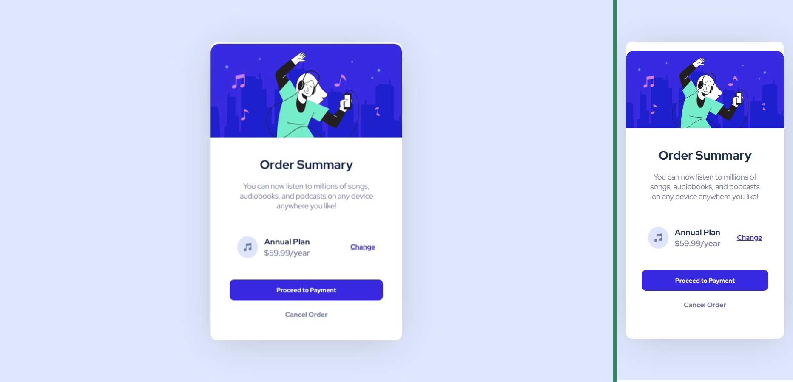

# Frontend Mentor - Order summary card solution

This is a solution to the [Order summary card challenge on Frontend Mentor](https://www.frontendmentor.io/challenges/order-summary-component-QlPmajDUj). Frontend Mentor challenges help you improve your coding skills by building realistic projects. 

## Table of contents

- [Overview](#overview)
  - [The challenge](#the-challenge)
  - [Screenshot](#screenshot)
  - [Links](#links)
- [My process](#my-process)
  - [Built with](#built-with)
  - [What I learned](#what-i-learned)
  - [Continued development](#continued-development)
- [Author](#author)

## Overview

### The challenge

Users should be able to:

- See hover states for interactive elements

### Screenshot

<figure>
  
</figure>

### Links

- Solution URL: [GitHub](https://github.com/abdellah-abadou/FM-Order-summary-card)
- Live Site URL: [Preview](https://your-live-site-url.com](https://front-mentor-order-summary-card.netlify.app/))

## My process

The project took me an hour and a half. I tried to complete it using pixels, but I realized the difficulty of this in the middle, and you can see that the site does not respond well to different screen resolution.

### Built with

- Semantic HTML5 markup
- CSS custom properties
- Flexbox

### What I learned

Using pixels is more difficult than I thought

### Continued development

Developing my ability to use pixels

## Author

- Frontend Mentor - [@abdellah-abadou](https://www.frontendmentor.io/profile/abdellah-abadou)

